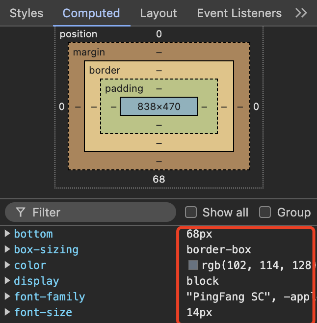

## 浏览器渲染机制

### 一、 URL 输入到页面展示完成，浏览器做了哪些工作了

理解浏览器的渲染必须先知道浏览器的几个主要的线程之间的工作与关系，浏览器的线程有很多很多，但对于渲染过程来说有参与最主要的就是 <b>渲染主线程</b>与<b>网络处理线程</b>

1. 网络处理线程工作

   1.1 输入 URL，发送请求到服务器

   1.2 服务器返回 HTML，网络处理线程接收到文档后产生<b>渲染任务</b>交给渲染线程的<b>消息队列中</b>

2. 渲染主线程工作

   2.1. 渲染线程循环消息队列，获取消息队列中的<b>渲染任务</b>来执行渲染

   2.2. 渲染线程解析 DOM 树，生成渲染树

   2.3. 渲染线程根据渲染树，渲染页面

   2.4. 渲染线程将渲染结果展示到页面上

```js
// 可以用一个函数来描述浏览器的渲染过程
function http_get_html(url) {
  //输入url获取HTML文档
  http.get(url).then((html) => {
    render(html);
  });
}
function render(html) {
  // 浏览器渲染就是一个巨大的render函数，接受一个html
  return "像素信息"; // 返回一个像素信息就是画面，然后展示到你眼前
}
```

3. 渲染任务详解

渲染主线程渲染页面的过程中浏览器的逻辑设计会启动别的辅助线程来加速解析，比如预解析 css，网络线程解析 url，因此才说，渲染 css 的时候，不影响 html 的渲染，就是因为浏览器在多线程渲染的原因

3.1 解析 html

3.2 样式计算
这一步生成 computed stylesheet


3.3 布局

这一步生成 layout tree，简称布局树，dom 树与布局树是不相等的，比如伪元素、display:none、隐藏行、隐藏块、浮动等等

因为这一步会出现很多元素因为隐藏、偏移、缩放等等影响布局的情况，所以需要单独计算布局（关联知识重排 ）

3.4 分层 （旧版本浏览器可能没有这个优化策略）

浏览器会将某些他认为比较容易变化的元素变成一个层，这样如果变化这层的内容时，别的层就不需要重新计算了，优化了性能

3.4 绘制 （类比 canvas api 做的事情）

绘制分层好的信息

3.5 分块 （合成线程来处理 composite thread）

启动多线程来处理分块渲染

3.5 光栅化 （GPU 加速，GPU 进程开启计算）

生成每个 块 的位图用于最后的显示，有限光栅化靠近显示窗口位置的 块

3.6 渲染

渲染进程将光栅化的的位图与相对屏幕显示的位置信息交给 GPU 渲染线程，GPU 线程最终给到显卡显示
