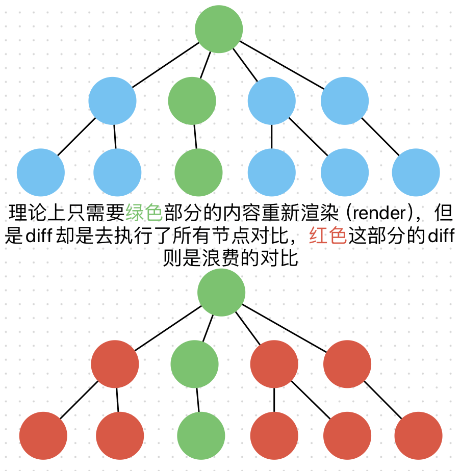

# React 口述问题

## React 书写优化

1. ### 避免不必要的 render

   由于 react 的 diff 算法的机制问题，当我们需要渲染一个子组件的时候，react 的内置 diff 处理是对比所有节点的同异，然后相同的不处理，不同的就重新渲染，导致了那些相同的组件的 diff 是多余的
   
   ps：这里只有 diff 算法浪费了，并不会去重新 render 红色部分不要搞混了<br>
   解决办法：我们可以使用 react 提供的 api：<b>shouldComponentUpdate、PureComponent、React.memo</b> 来做优化，减少不必要的 diff 开销  
   除此之外

2. ### 避免使用内联函数&&事件绑定优化
   如果使用内联函数，那么每次组件 render 的时候，js 都会去重新创建一个函数实例，这样会浪费 cpu 算力与内存  
   所以建议在组件内部定义好函数后去引用比较好

```js
// 内联写法
class App extends React.Component {
  render() {
    arr.map((item, index) => {
      return (
        <div
          key={index}
          onClick={
            // 每次render都会重新创建这个函数，浪费cpu与内存
            () => {
              this.setState({
                a: 1,
                b: 2,
                c: 3,
                d: 4,
              });
            }
          }
        >
          {item}
        </div>
      );
    });
  }
}
// 非内联写法
class App extends React.Component {
  setDate: () => {
    // render 的时候不用每次都重新创建，直接使用引用即可
    // use code do something
  };
  render() {
    arr.map((item, index) => {
      return (
        <div key={index} onClick={this.setDate}>
          {item}
        </div>
      );
    });
  }
}
// 同时还需要注意事件绑定的写法,不同的绑定方式获取this的指向方式不同
// 1. 在render的时候会重新bind this,浪费性能
handleClick() {
  console.log('this > ', this);
}
<div onClick={this.handleClick.bind(this)}>test</div> // 这里如果是一个组件，那么这么写的话父组件一旦重新render，这个子组件就会重新渲染，props改变了（当然这是可以优化的）

//2. 使用箭头函数，如上面 内联写法 一样，会浪费性能
handleClick() {
  console.log('this > ', this);
}
<div onClick={()=>this.handleClick}>test</div> // 这里如果是一个组件，那么这么写的话父组件一旦重新render，这个子组件就会重新渲染，props改变了（当然这是可以优化的）
//下面是优化写法
// 1. 类组件，在constructor中绑定一次this，则不需要在render中重复绑定this
constructor(props) {
  super(props);
  this.handleClick = this.handleClick.bind(this);
}
handleClick() {
  console.log('this > ', this);
}
<div onClick={this.handleClick}>test</div>
// 2.函数式组件与类组件通用，在函数定义时就使用箭头函数绑定this
// 🌟推荐
handleClick = () => {
  console.log('this > ', this);
}
<div onClick={this.handleClick}>test</div>

```

3. ### 使用 空标签 <b style="color:red"><></></b> (React Fragments)来减少渲染开销

   react 组件要求必须有且只有一个顶层标签包裹，一般我们会给一个 \<div> 标签来当做顶层标签包裹组件内部的内容，但是\<div>是一个有内容的标签，在浏览器渲染页面的过程中，会给标签创建 dom 与 cssom，会造成额外的渲染开销（请看<a href='../2.浏览器渲染机制/浏览器渲染.md'>浏览器渲染</a>），所以使用 <b style="color:red"><></></b>空标签 来作为顶层标签比较好

4. ### react 中父组件 render 子组件必定 render 吗？
   首先结论肯定是不正确
   1. 如果父组件的 props 与 state 没有发生改变时，子组件不会重新 render
   2. 如果子组件使用了 PureComponent，shouldComponentUpdate，React.memo 这些方式来来优化了 render 方式，那么子组件也不会重新 render
   3. 使用 props.children 传递无状态组件， 父组件传递 props 时，对于引用类型传递的是地址，执行父组件的 render 时，若 props.children 的引用地址没变化，则子组件不会重新渲染
5. ### usememo，useeffect，useCallback，uselayouteffect 区别

6. ### React 的 Fiber 架构是什么
