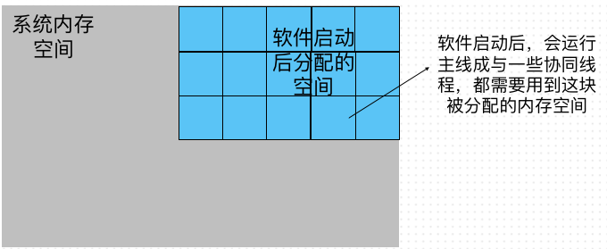
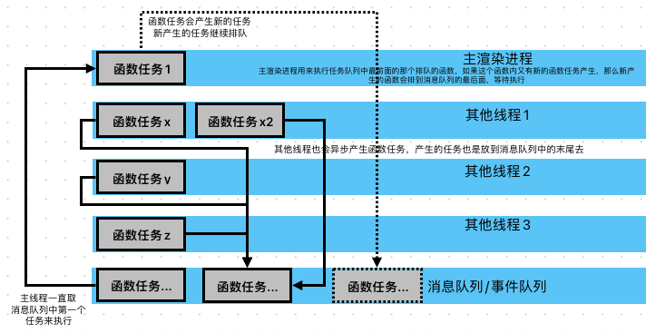
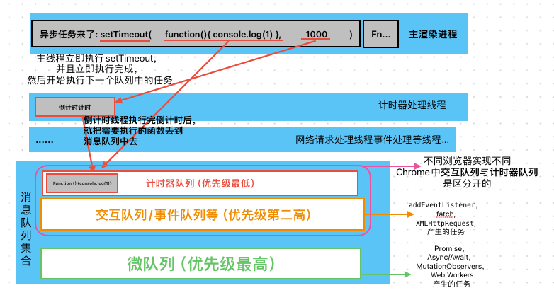

## 事件循环

### 一：浏览器的进程模型

1. 浏览器开启后会开启一个进程，称为主进程，浏览器是<b>多进程，多线程</b>程序
   
   浏览器也一样，浏览器启动后会运行 <b>主进程</b> 与其余的进程<b>（主要有渲染进程，事件循环进程，网络进程）</b> 这些进程都是用到独立的内存空间，理论上不会互相影响

2. 线程，  
   每个进程中都有多个线程，进程去拿到运行的空间与基础环境，线程才是执行工作的那一个，对于前端来讲最重要的是 <b>浏览器的主进程中主渲染线程</b>  
   浏览器的主进程中的主渲染线程就是处理 js，css，html，渲染页面重绘重排，计时器，事件循环等工作的线程

3. 事件循环  
   当所有的 js 相关的执行都在一个线程中执行时，这个主渲染线程会一直循环执行，边循环边去看消息队列中是否有在排队的任务，如果有就执行，没有就一直空循环（其实就是死循环，只是浏览器做了优化,会挂起线程，休眠线程）
   

```js
// ps: 无限循环 js 的几个写法
for (;;);
while (true);
do {} while (true);
```

4. 异步函数与事件循环的恩怨  
   js 是单线程（只有一个执行主线程），当遇到异步的场景的时候，比如说用了 setTimeout 之类的方法，如果是同步处理的话，那主线程就必须等着倒计时结束才能开始执行接下来的消息队列中的任务，这样会造成程序阻塞，所以才设计成异步功能，
   
   注意：消息队列是有多个的，前端关注: 微队列，交互队列（一般可能是网络异步产生，点击事件产生），计时队列（倒计时等函数产生）即可。  
   浏览器优先级是 <b>微队列> 交互队列 > 计时队列</b>

```js
// ps:有哪些异步函数
setTimeout(() => {
  fn;
});
setInterval(() => {
  fn;
});
new Promise((resolve, reject) => {
  resolve(fn);
});
setImmediate(() => {
  fn;
});
MutationObservers;
Async / Await;
```
